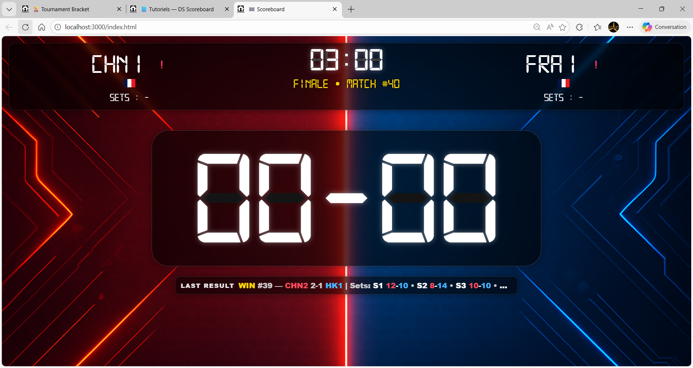
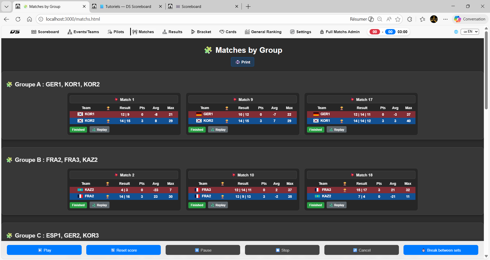

# DS Scoreboard

**DS Scoreboard** est une plateforme complète de gestion de compétitions **Drone Soccer** :  
arbitrage, scoreboard, overlays OBS et affichage live, pensée pour les événements réels.

---

## 🎯 Fonctionnalités principales
- Gestion des équipes, groupes et phases finales
- Scoreboard arbitre en temps réel
- Brackets KO complets
- Gestion des pénalités, sanctions et cartons
- Gestion des pilotes
- Statistiques de compétition
- Overlays OBS dédiés (score, next match, break, finale, golden goal, pénalités…)
- Support multi-langue (FR / EN)
- Intégration matériel & broadcast

---

## 📸 Aperçu
*(captures à placer dans docs/screenshots/)*

---

## 📺 Streaming & OBS
DS Scoreboard est conçu pour le **broadcast live** :
- Overlays OBS prêts à l’emploi
- Import OBS fourni
- Synchronisation scoreboard / arbitrage / affichage
- Utilisation multi-écrans

---

## 🔒 Accès au logiciel
Le logiciel **n’est pas disponible en téléchargement public**.

L’accès est fourni **sur commande avec le pack complet sur un site dédié** aux :
- clubs,
- organisateurs,
- fédérations,
- événements Drone Soccer.

👉 Contact : dronatronic@gmail.com

---

## 📦 Versions
- **v1.1.2** : base fonctionnelle tournoi & scoreboard
- **v1.2.0** : orientation OBS & streaming
- **v2.0** : plateforme complète de compétition

---

## 📄 Changelog
Voir le fichier [CHANGELOG.md](CHANGELOG.md)

---

## ℹ️ À propos
DS Scoreboard est un outil développé **par et pour le Drone Soccer**,  
testé en conditions réelles de compétition.
 Base tournoi + overlays OBS de base + i18n
